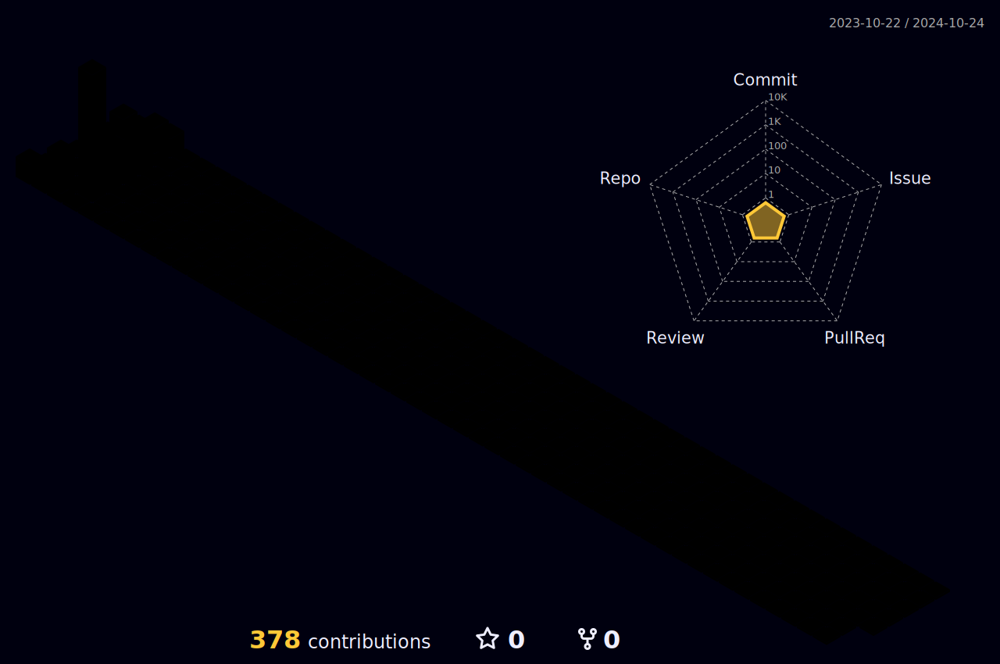

I'm 22-year-old boy on an intention to enhance as a front-end developer.

- 🔭 I’m currently working on Admin Dashboard Template based on Vue JS
- 🌱 I’m currently Learning VueJs & Vuex
- 🤔 I’m looking for a good project
- 💬 Ask me about VueJs & Javascript
- 📫 How to reach me: [mehdi.localhost@gmail.com](mailto:mehdi.localhost@gmail.com)
- 😄 Pronouns: He
- ⚡ Fun fact: Big fan of 🌈

 <br/>
 
## 👨‍💻 &nbsp;Tech Stack :
### &nbsp;- Languages, Libraries, Frameworks, Tools  


&nbsp;
&nbsp;
&nbsp;
&nbsp;
&nbsp;
&nbsp;
&nbsp;
&nbsp;
&nbsp;
&nbsp;

<br/>

<p>
  
  
  
  <a href="https://github.com/SOURAB-BAPPA?tab=followers">
    
  </a>
</p>


## My Github Status 

  

   




<h4 align="center">
  
```diff
+@ @ @ @ @ @ @ @ @ @ @ @ @ @ @ @ @ @ @ @ @ @ @ @ @ @ @ @+
@@       o o                                           @@
@@       | |                                           @@
@@      _L_L_                                          @@
@@   ❮\/__-__\/❯ Programming isn't about what you know @@
@@   ❮(|~o.o~|)❯  It's about what you can figure out   @@
@@   ❮/ \`-'/ \❯                                       @@
@@     _/`U'\_                                         @@
@@    ( .   . )     .----------------------------.     @@
@@   / /     \ \    | while( ! (succed=try() ) ) |     @@
@@   \ |  ,  | /    '----------------------------'     @@
@@    \|=====|/                                        @@
@@     |_.^._|                                         @@
@@     | |"| |                                         @@
@@     ( ) ( )   Testing leads to failure              @@
@@     |_| |_|   and failure leads to understanding    @@
@@ _.-' _j L_ '-._                                     @@
@@(___.'     '.___)                                    @@
+@ @ @ @ @ @ @ @ @ @ @ @ @ @ @ @ @ @ @ @ @ @ @ @ @ @ @ @+
```
  
  
</h4>  

## Watch my contribution graph being eaten by a snake🐍

<p align="center">
  </center>
</p>

<details>
<summary></summary>

[](https://www.github.com/LorestaniMe)

</details>
<!--END_SECTION:activity-->


 


## Spotify Playing 🎧
[]

<p align="right"><a href="#top"></a></p>


